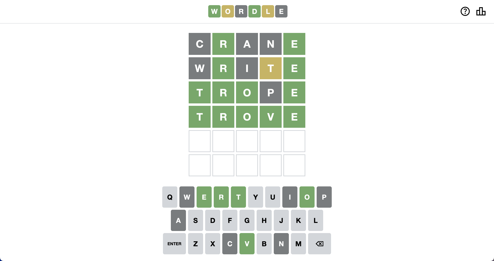
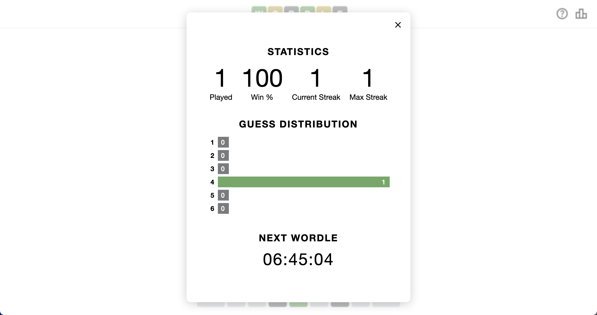

# Wordle

This is a clone of the popular word game [Wordle](https://www.nytimes.com/games/wordle/index.html) written in Vanilla Javascript. The app is deployed on Github and can be accessed [here](https://pan-cynthia.github.io/wordle/).




## Getting Started

To install and run the app locally, follow these steps:

1. Clone the repo:

```bash
git repo clone https://github.com/pan-cynthia/wordle.git
```

2. Install the dependencies:

```bash
npm install
```

3. Start the development server:

```bash
npm run dev
```

4. Open [http://localhost:3000](http://localhost:3000) in your browser to start playing.

## How to Play

1. The computer chooses a random five-letter word to be the word of the day.
2. You have 24 hours to guess the word before it resets at midnight.
3. You have **six** guesses in total.  
a. Each guess must be a valid five-letter word.  
b. You may not guess a word that you have already guessed.
4. The color of the tiles will change to show how close your guess was to the word.  
a. If a letter in your guess is in the correct position in the word, it will appear in **green**.  
b. If a letter in your guess is in the word but in the wrong position, it will appear in **yellow**.  
c. If a letter in your guess is not in the word at all, it will appear in **grey**.

## Stretch Goals

1. Add account login so scores can be saved.
2. Share your score with your friends via social media/text.
3. Use a database instead of local storage to save user data.
